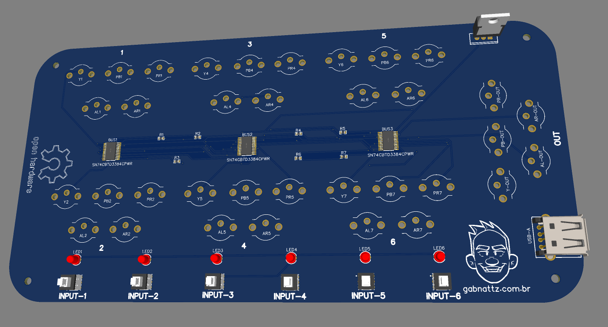

# Project Idea and Necessities

The main idea behind this project was to fill a need I had for some kind of component video switcher, i.e. Y, Pb and Pr, with at least 6 inputs and one output, where I wouldn't have to spend too much to assemble it.

For a long time I used a switch box bought from Aliexpress that served me well but recently I bought a Retrotink 5x and the “greenish” appearance and some "ground issues" started to bother me, so I decided to design something that would better fit my requirements as I couldn't find anything different and cheaper than that same box and the [Gcomp Switcher](https://www.retrorgb.com/?s=gcomp), but, as I said before, I couldn't afford to buy one for $$$ reasons.

The main inspiration I had was a [2007 post](https://www.engadget.com/2007-03-13-how-to-make-a-solid-state-a-v-switcher.html) from a guy named Benjamin Heckendorn, wich gave me the idea to try it out. *(Thank you buddy, your post thought me a lot!)*

Since it is Open Sourced forever, you can tweak the [original .json file](./Component%20Switcher%20V1/Component%20Switcher%20V1%20Rev1.2.json) with [EasyEDA](https://easyeda.com/) or similar and open an issue here if you find anything that could be improved!

# How it works?
It has 3 SN74CBTD3384CPWR buzz switchers that are activated by the 5v rail depending on the power switch you pressed where the specific led will light up and output the desired component video.

This project aims to be a *SIMPLE* maintaining a good video quality with as little image noise as possible!

- It was designed with retro consoles in mind.
- It should NOT be used with more than one console turned on at the same time as it generates a lot of interference in the image!
- A quality power supply of 5v and around 2a is required (I used a Xiaomi phone charger for extensive testing and everything worked correctly)
- It is designed to be assembled with parts easily found on Aliexpress for cheap!

# Nice to have (Help needed)
It would be really cool to have a acrylic plate on top and bottom part or even a 3d printed case, wich would turn it into a beautiful cheap switcher, so if you want to help, tweak or improve feel free to contact me or open a issue!

# Comparisons
>Chinese box:

Component Switcher:

> Chinese box:

Component Switcher:

1. Chinese tests
[video](./Videos/China.mov)
2. Component Switcher tests
[video](./Videos/Meu.mov)

# Outro
> If you build by yourself, ask help to a friend or even sell, please let people know from where it came, it would make me pretty happy to know that my little project is helping people out!

That's the prototype board and I still have 4, if you want one send me a message over [socials](https://gabnattz.com.br/)!
